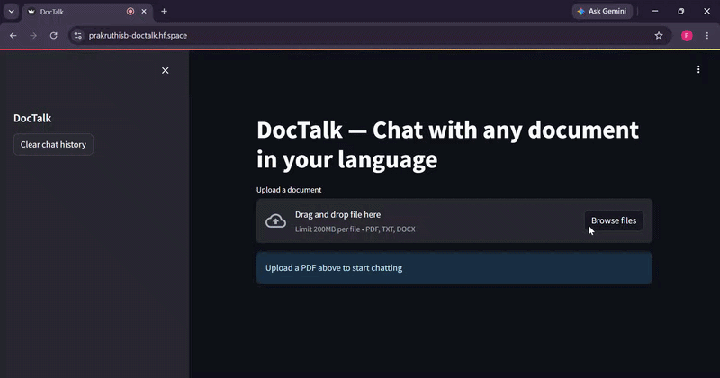

# 💬 DocTalk — Multilingual Document Q&A Assistant

Ask questions about any document in **8 Indian languages** — get answers in the same language back. Built using RAG (Retrieval Augmented Generation) with LLaMA 3.1, LangChain, FAISS, and Sarvam AI.

---

## 🌐 Live Demo

🔗 [your-huggingface-space-url] *(update after deployment)*

---

## 📌 Overview

Most RAG/document Q&A tools only work in English. DocTalk eliminates this barrier — a user can upload a PDF, type a question in Hindi, Kannada, Tamil, or any supported Indian language, and receive a contextually accurate answer in the same language.

Internally, DocTalk translates the question to English, runs RAG retrieval + LLM generation, then translates the answer back — making the entire pipeline language-transparent to the user.

---

## ✨ Features

- 📄 **Multi-format support** — PDF, DOCX, TXT
- 🌍 **8 Indian languages** — Hindi, Kannada, Tamil, Telugu, Malayalam, Marathi, Bengali, English
- 🔍 **RAG pipeline** — semantic chunk retrieval via FAISS, not keyword search
- 🧠 **LLaMA 3.1 8B** via Groq for fast, accurate answer generation
- 💬 **Full chat history** — follow-up questions understood in context
- 📄 **Source page display** — shows exactly which page the answer came from
- ⚡ **Sub-3 second responses** on Groq free tier
- 🐳 **Dockerised** — deployed on Hugging Face Spaces

---

## 🔁 Architecture

```
User uploads PDF / DOCX / TXT
            │
            ▼
┌─────────────────────────┐
│    Document Loading     │  PyMuPDFLoader / Docx2txtLoader / TextLoader
└─────────────────────────┘
            │
            ▼
┌─────────────────────────┐
│     Text Chunking       │  RecursiveCharacterTextSplitter
│  chunk_size=500         │  chunk_overlap=50
└─────────────────────────┘
            │
            ▼
┌─────────────────────────┐
│  Embedding Generation   │  sentence-transformers/all-MiniLM-L6-v2
└─────────────────────────┘
            │
            ▼
┌─────────────────────────┐
│    FAISS Vector Store   │  Top-k semantic retrieval (k=4)
└─────────────────────────┘
            │
    User asks question
    (any Indian language)
            │
            ▼
┌─────────────────────────┐
│   Sarvam AI Translate   │  Question → English + language detection
└─────────────────────────┘
            │
            ▼
┌──────────────────────────────┐
│  ConversationalRetrievalChain │  LangChain + chat history memory
│  LLaMA 3.1 8B via Groq       │
└──────────────────────────────┘
            │
            ▼
┌─────────────────────────┐
│   Sarvam AI Translate   │  English answer → user's language
└─────────────────────────┘
            │
            ▼
     Answer + Source Pages
     displayed in chat UI
```

---

## 🛠️ Tech Stack

| Component | Technology |
| --- | --- |
| Frontend | Streamlit |
| LLM | LLaMA 3.1 8B via Groq API |
| RAG Framework | LangChain (ConversationalRetrievalChain) |
| Vector Store | FAISS |
| Embeddings | Sentence Transformers (all-MiniLM-L6-v2) |
| Multilingual | Sarvam AI (translation + language detection) |
| Document Loading | PyMuPDF, Docx2txt, LangChain TextLoader |
| Containerisation | Docker |
| Deployment | Hugging Face Spaces |

---

## 🌍 Supported Languages

| Language | Code |
| --- | --- |
| Hindi | `hi` |
| Kannada | `kn` |
| Tamil | `ta` |
| Telugu | `te` |
| Malayalam | `ml` |
| Marathi | `mr` |
| Bengali | `bn` |
| English | `en` |

---

## 🗂️ Project Structure

```
doctalk/
│
├── src/
│   ├── document_loader.py    # PDF / DOCX / TXT loading + chunking
│   ├── vector_store.py       # FAISS index building + retriever
│   ├── rag_chain.py          # ConversationalRetrievalChain + Groq LLM
│   └── multilingual.py       # Sarvam AI translation + language detection
├── app.py                    # Streamlit frontend with chat history
├── Dockerfile
├── requirements.txt
├── .env.example              # Template — never commit .env
└── README.md
```

---

## ⚙️ Installation & Local Setup

```bash
# Clone the repository
git clone https://github.com/your-username/doctalk.git
cd doctalk

# Install dependencies
pip install -r requirements.txt

# Set environment variables
cp .env.example .env
# Fill in your keys in .env

# Run the app
streamlit run app.py
```

### 🔑 Required API Keys

| Service | Purpose | Get Key |
| --- | --- | --- |
| [Groq](https://groq.com) | LLM inference (free tier) | groq.com |
| [Sarvam AI](https://sarvam.ai) | Translation + language detection | dashboard.sarvam.ai |

### 🐳 Run with Docker

```bash
docker build -t doctalk .
docker run -p 8501:8501 \
  -e GROQ_API_KEY=your_key \
  -e SARVAM_API_KEY=your_key \
  doctalk
```

---

```markdown

```

---

## 🔮 Future Improvements

- Voice input using Sarvam AI speech-to-text
- Support for scanned PDFs using OCR (pytesseract)
- FAISS index persistence — no re-embedding on page refresh
- Vector search optimisation using pgvector
- Multi-document chat — query across multiple uploaded files

---

⭐ If you find this useful, consider giving it a star!